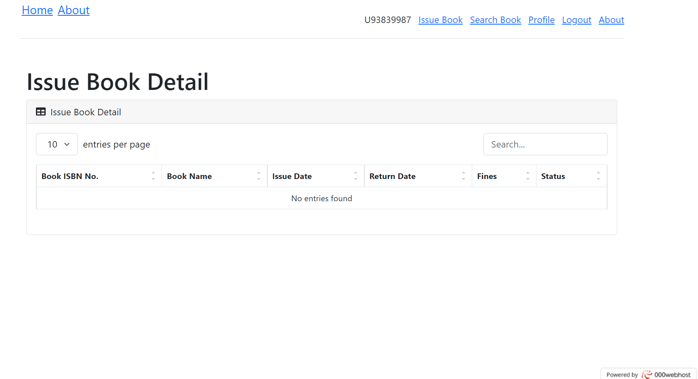

# Library Management System

<h2>Live Demo: https://danishproj101.000webhostapp.com/index.php </h2>
<h2>Structure of App</h2>
 ⚈ Admin login - > Admin Dashboard
  ⚈ User login - > User Dashboard

 <h2>Introduction:</h2> A library management system is about organization, library management, and library-oriented tasks. It also includes keeping a database of new books entered and records of books that have been picked up or issued, with the relevant date.
  
 <h2>Objective of this project:</h2>
The main aim of this project is providing an easy to handle and automated library management system. This project also provides features and interface for maintaining librarian’s records, student’s history of issue and fines.

The owner can easily update, delete and insert data in the database with this project.The following are some of the features provided by this project:

1. Login/SignUp.
2. Add a new students details.
3. Remove the details of students.
4. Update the details of students.
5. Print the details of studnets, etc.

<h2>For Deployment:</h2>
Use Xampp server, save project inside htdocs folder and open index.php file

<h2>Application screenshots:</h2>
Use Xampp server, save project inside htdocs folder and open index.php file

### Home page

### User login

### Admin Login

### Admin Dashboard

### User Dashboard

